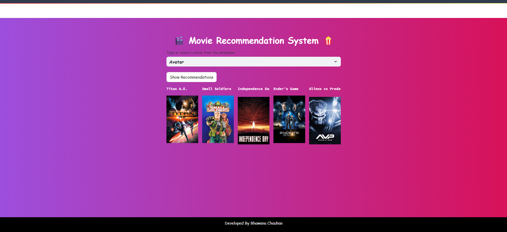

# Movie Recommendation System

Welcome to the Movie Recommendation System! This project aims to provide personalized movie recommendations based on user preferences and historical data.

## Table of Contents

- [Introduction](#introduction)
- [Features](#features)
- [Installation](#installation)
- [Usage](#usage)
- [Project Structure](#project-structure)
- [Technologies Used](#technologies-used)
- [Contributing](#contributing)
- [License](#license)
- [Contact](#contact)

## Introduction

The Movie Recommendation System is designed to suggest movies to users based on their past interactions and preferences. This system leverages data science techniques to analyze user behavior and generate tailored recommendations.

## Features

- Personalized movie recommendations
- Interactive user interface
- Data analysis and visualization
- Scalable and efficient algorithms

## Installation

To get started with the Movie Recommendation System, follow these steps:

1. Clone the repository:
   git clone https://github.com/yourusername/movie-recommendation-system.git

2. Navigate to the project directory:
   cd movie-recommendation-system
  

3. Install the required dependencies:
   pip install -r requirements.txt

## Usage

To run the application, use the following command:

streamlit run app.py

This will start the application, and you can access it via your web browser at `http://localhost:5000`.

## Project Structure

The project directory contains the following files:

- `movie recommendation system.ipynb`: Jupyter notebook containing the data analysis and model building code.
- `app.py`: Main application file to run the web server.
- `requirement.txt`: contain all the packages name which is used in this project.
- `Datasets`: 2 Datasets are used . 1) credits 2) movies 

## Output

Here is an example of the output generated by the Movie Recommendation System:

## Technologies Used

- Python
- Streamlit
- Pandas
- Scikit-Learn
- Jupyter Notebook
- pickle
- Vs Code

## More Details
- take the dataset from kaggle website
- movies recommendation.ipynb - create two files 1) movie.pkl 2) similarity.pkl

## Contributing

Contributions are welcome! If you have any suggestions or improvements, please create an issue or submit a pull request. Make sure to follow the code of conduct and contribution guidelines.

## Contact

For any questions or feedback, please contact:

- Name: Bhawana Chauhan
- Email: 210160203059.bhawana@gdgu.org

Thank you for using the Movie Recommendation System!
